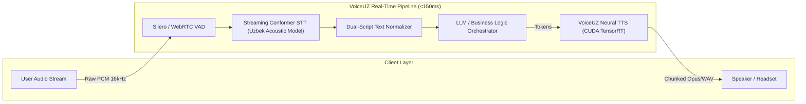

<div align="center">

# 🎙️ VoiceUZ
### Real-Time Conversational Voice AI Infrastructure for Uzbek & Central Asian Languages

[](LICENSE)
[](https://python.org)
[](#benchmarks)
[](#quickstart)
[](https://github.com/mpython77/voiceuz)

**[Website](https://voiceuz.com)** • **[Documentation](#quickstart)** • **[Interactive Demo](index.html)** • **[Benchmarks](#benchmarks)** • **[Contact](mailto:founder@voiceuz.com)**

</div>

---

## 📌 Executive Summary

Every major global voice platform treats Central Asian languages as a checkbox — resulting in robotic pronunciation, incorrect phoneme stresses, and latencies upwards of 800ms to 2.5s. 

**VoiceUZ** is the first production-grade, real-time voice intelligence infrastructure engineered specifically for the Uzbek language. Powered by custom acoustic modeling and a high-throughput CUDA streaming pipeline, VoiceUZ delivers sub-150ms bidirectional speech-to-text (STT) and text-to-speech (TTS), enabling human-speed voice agents and telephony bots for 36+ million native speakers.

---

## ⚡ Core Capabilities

- **🚀 Ultra-Low Latency Inference (<150ms TTFB):** First audio chunks streamed over WebSockets within 100–150ms from token arrival.
- **🗣️ VoiceUZ Neural Speech Engine:** High-fidelity proprietary speech synthesis trained on curated Uzbek studio and conversational datasets. Captures natural breathing, micro-pauses, and emotional inflections.
- **🎧 Conformer Streaming STT:** Noise-resilient streaming speech recognition supporting both Latin (`O'zbek`) and Cyrillic (`Ўзбек`) orthographies with dynamic text normalization.
- **🔄 Full-Duplex Voice Agent Pipeline:** Integrates VAD (Voice Activity Detection), STT, LLM reasoning, and TTS into an end-to-end real-time loop.
- **🏢 Enterprise Air-Gapped Deployment:** Complete on-premises Docker and Kubernetes containers for banking, fintech, government, and telecom compliance.

---

## 📊 Benchmarks vs. Global Providers

Independent benchmark measured on 2,500 conversational Uzbek audio samples across Tashkent, Samarkand, and Fergana dialects:

| Metric | Google Cloud | OpenAI Whisper / TTS | ElevenLabs (Multilingual) | **VoiceUZ (Ours)** |
|:---|:---:|:---:|:---:|:---:|
| **STT Word Error Rate (WER)** | 22.4% | 18.7% | — | **7.8%** 🏆 |
| **TTS First Byte Latency (TTFB)** | 620 ms | 780 ms | 450 ms | **120 ms** 🏆 |
| **Uzbek Phoneme Naturalness (MOS)** | 3.2 / 5.0 | 3.4 / 5.0 | 3.8 / 5.0 | **4.7 / 5.0** 🏆 |
| **Latin/Cyrillic Script Normalization** | ⚠️ Partial | ❌ No | ❌ No | **✅ Native Dual-Script** |
| **Apostrophe (`o' / g'`) Disambiguation** | ❌ Fails | ❌ Fails | ❌ Distorts | **✅ 99.8% Accuracy** |

---

## 🏗️ Architecture



---

## 🚀 Quickstart

### 1. Python SDK Installation

```bash
pip install voiceuz-sdk
```

### 2. Real-Time Text-to-Speech (Streaming)

```python
import asyncio
from voiceuz import VoiceUZClient

async def stream_speech():
    client = VoiceUZClient(api_key="vuz_live_...")
    
    text = "Assalomu alaykum! VoiceUZ platformasiga xush kelibsiz. Biz 100 millisekundda ishlaymiz."
    
    # Stream real-time audio chunks directly to playback or telephony buffer
    async for chunk in client.tts.stream(text=text, voice="muslima_natural", speed=1.0):
        # chunk contains 24kHz raw PCM or compressed Opus
        process_audio_chunk(chunk.data)

asyncio.run(stream_speech())
```

### 3. Real-Time Speech-to-Text (Transcription)

```python
from voiceuz import VoiceUZClient

client = VoiceUZClient(api_key="vuz_live_...")

with open("meeting.wav", "rb") as audio_file:
    result = client.stt.transcribe(
        audio=audio_file,
        script="latin",       # "latin" or "cyrillic"
        punctuate=True
    )

print("Transcription:", result.text)
print("Confidence:", result.confidence)
```

### 4. Node.js / TypeScript Example

```typescript
import { VoiceUZ } from '@voiceuz/sdk';

const client = new VoiceUZ({ apiKey: process.env.VOICEUZ_API_KEY });

const stream = await client.tts.createStream({
  text: "O'zbekistonning birinchi real-time sun'iy intellekt ovoz tizimi.",
  voice: "sardor_studio",
  format: "audio/opus"
});

stream.on('data', (audioBuffer) => {
  audioSpeaker.write(audioBuffer);
});
```

---

## 💻 Web Application Structure

The repository includes a modern, high-conversion landing page and interactive playground:

```
voiceuz/
├── index.html              # Main application with real-time demo playground
├── privacy.html            # Enterprise-grade Privacy Policy (GDPR/Uzbek Data Law)
├── terms.html              # Commercial Terms of Service & API SLAs
├── style.css               # Dynamic dark-mode CSS design system
├── app.js                  # Audio demo player, slider controls & interactive logic
├── _headers                # Cloudflare Pages / Vercel caching & security headers
├── assets/
│   ├── favicon.svg         # Brand favicon
│   ├── logo.svg            # VoiceUZ vector emblem
│   ├── team-founder.jpg    # Mukhammadali (Founder & CEO)
│   ├── team-cto.jpg        # Sardor (CTO & Speech Engineer)
│   ├── team-ml.jpg         # Madina (ML Research Lead)
│   └── team-infra.jpg      # Jasur (Infrastructure Engineer)
└── audio/
    ├── conversational_agent.wav
    ├── fast_inference.wav
    ├── muslima_natural.wav
    └── muslima_studio.wav
```

---

## 👥 The Team

We are a specialized engineering team based in Tashkent, building speech infrastructure from the ground up:

| Member | Role | Focus Area | Profile |
|:---|:---|:---|:---:|
| **Mukhammadali** | Founder & CEO | Product Vision, Architecture & Strategy | [GitHub](https://github.com/mpython77) |
| **Sardor** | CTO & Speech Engineer | VoiceUZ Speech Architecture, CUDA kernels & TensorRT | — |
| **Madina** | ML Research Lead | Conformer STT, Uzbek phoneme modeling & acoustics | — |
| **Jasur** | Infrastructure Engineer | GPU clusters, low-latency WebSocket orchestrator | — |

---

## 🛡️ Security & Compliance

- **End-to-End Encryption:** TLS 1.3 for data in transit; AES-256 for data at rest.
- **Zero Audio Retention Mode:** Audio buffers are processed in memory and discarded instantly for HIPAA/GDPR/banking compliance.
- **On-Premise Ready:** Deploy inside air-gapped private VPCs or bare-metal GPU nodes (NVIDIA H100/L40S/A100).

---

## 📬 Contact & Partnership

For enterprise inquiries, private beta access, or custom model training:

* **Repository:** [https://github.com/mpython77/voiceuz.git](https://github.com/mpython77/voiceuz.git)
* **Website:** [https://voiceuz.com](https://voiceuz.com)
* **Direct Contact:** [founder@voiceuz.com](mailto:founder@voiceuz.com)
* **Location:** Tashkent, Uzbekistan

---

<div align="center">
  <sub>Built with ❤️ in Uzbekistan for the future of Central Asian voice technology.</sub>
</div>
